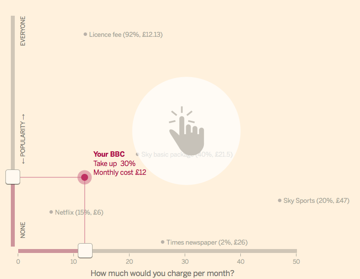

##EX 4 - code structure for interactive graphics

So far we've only really considered graphics that takesome data and get redrered once -- in terms of user input the most complext case we've looked at is resizing the browser window. Accepting user input which then changes the data which in turn changes the visualisation of that data is a great opportunity to get your code tied up in all sorts of knots.

Before we look at some specific techniques it's worth quickly looking back at some of the good habits we've seen in the earlier excercises

 * __Make funtions without side effects__: There are techy CS reasons for this but in practical terms it makes them easier to consider as black boxes, letting you think of them as an abstraction rather and a set of implementation details. It makes it easier to think about you program as a whole. 

 * __Separate concerns__: The process ▶️ 1. get the data ➡️ 2. process the data ➡️ 3. draw the data. If you treat each of these steps as separate considering the inputs and outputs you expect from each stage, that's a good start to producing modular code.

 * __Use ```call``` for complex bits for the vis__: for putting multiple children on a parent selection then call is indispensable, it'll also make it easier to abstract and resuse complex bits of code with almost not extra effort up front. 

##Make some inputs and outputs
in this case we have 3 inputs and 3 outputs (each input looks like an output but it's useful to separate them conceptually)
 


How do we keep all those things in sync without overwhelming amounts of code, repetetive code etc.

##Make a model

What we want here is a single source of __THE TRUTH__ something that represents the state of the application and its data ( this might be two things or one thing with two bits but the fact is its easy to change data and state  without haveing to worry about the whole app getting he message ).

A simple model for the above might look like this:

```
var model = {
	x:100,
	y:100
};
```

but when you change a property on the model you need to let everything know how do you do that?

##Make an event dispatcher

There are plenty of libraries which provide Javascript with a mechanism to easily dispatch custom events. We'll use D3 as for visualisations you'll probably have that on the page anyway.

Here's and example of an event dispatcher in D3

```
var dispatcher = d3.dispatch('myEvent');

dispatcher.on('myEvent', function(){
	console.log('my event happened');
});

//trigger the event like this
dispatcher.myEvent();
```
note if you want more than one thing to happen on a given event you need to differentiate in the handler by giving a unique sting follwing a `.` (slightly annoying)
e.g.

```
dispatcher.on('myEvent.a', function(){ 
//do one thing });

dispatcher.on('myEvent.b', function(){ 
//do another thing });
```

###Provide an 'official' way to modify the model

The model should have an event dispatcher as a property so it can signal to the outside world when it changes but in order to actually trigger that signal we need the model to notice whe it has changed. THe easiest way to do this is by providing it with a set method via which the rest of the app must adjust its properties
somrthing like

```
function X(x){
	if(!x) return model.x;
	model.x = x;
	dispatcher.change(model);
}
```

note: the dispacher's function call passes the `model` as an argument, this is an easy way to ensure any listener has access to its properties.

####branch: make-an-event-dispatcher
